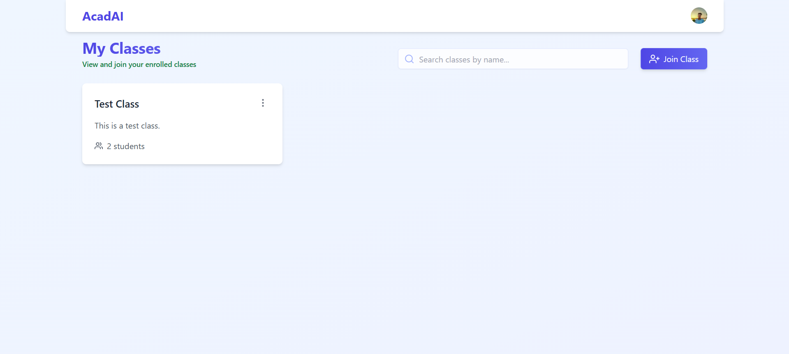
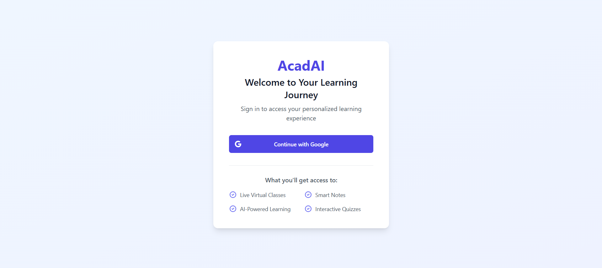

# 🎓 AcadAI - The Smart E-Learning Platform

AcadAI is an advanced e-learning platform that empowers instructors and students with interactive virtual classrooms, and a powerful note-taking system. 🚀

## 🔗 Live Demo

Check out the live version of AcadAI here: [AcadAI](https://acadai-client.vercel.app) 🚀

## 🛠 Technologies Used

AcadAI is built using modern technologies to ensure a seamless learning experience. Here’s what powers the platform:

### Frontend

- **React.js** – For building the interactive user interface.
- **Tailwind CSS** – For fast and responsive styling.

### Backend

- **Node.js & Express.js** – For handling server-side logic and API requests.
- **MongoDB** – As the database for storing user and course data.

### Authentication

- **Google OAuth & JWT** – Secure login authentication using JSON Web Tokens.

### Deployment & Version Control

- **Frontend:** [Vercel](https://vercel.com/)
- **Backend:** [Render](https://render.com/)
- **Version Control:** [Github](https://github.com/)

These technologies together make **AcadAI** a powerful and efficient e-learning platform! 🚀

## 🚀 Features

✅ **Rich Text Note-Taking**

- A simple yet powerful text editor supporting **H1, H2, H3**, **bold, italic, underline**, and text colors (**red, green, blue, black**).

✅ **Google OAuth Authentication**

- Secure and seamless login with Google, backed by **JWT authentication**.

✅ **Instructor Dashboard**

- Create and manage classes with **unique class codes**.
- Upload and share **important resources**.
- Design and publish **interactive quizzes** for students.

✅ **Student Dashboard**

- Take **quizzes** to test knowledge and track progress.
- Write **personal notes** using the built-in text editor.
- Start and engage in **discussions** with instructors and peers.

✅ **Organized Learning Environment**

- Separate dashboards for **instructors and students**.
- Intuitive and clutter-free UI for an enhanced learning experience.

✅ **Fast & Scalable Architecture**

- Built with **MERN stack** for high performance.
- Secure and optimized backend with **Node.js & MongoDB**.

## 🔨 Development Process

Building **AcadAI** was an exciting journey, crafted step by step to ensure a seamless learning experience. Here's how it all came together:

1️⃣ **Google Authentication & User Flow**

- Implemented **secure OAuth login** with Google, ensuring seamless authentication via **JWT**.

2️⃣ **Dashboard Creation**

- Designed **separate dashboards** for instructors and students, focusing on intuitive navigation and usability.

3️⃣ **Resource Management**

- Instructors gained the ability to **upload, manage, and share documents** with students in a structured environment.

4️⃣ **Interactive Quiz System**

- Developed a **dynamic quiz feature**, enabling instructors to create tests and students to attempt them with instant feedback.

5️⃣ **Personal Notes & Discussions**

- Integrated a **rich text editor** for students to take **structured notes**.
- Enabled **discussions**, allowing students to interact and collaborate with peers and instructors.

6️⃣ **Bug Fixes & Enhancements**

- Fine-tuned the application, resolving **bugs, and performance issues**.

7️⃣ **Deployment & Optimization**

- Deployed the platform with **scalability and security** in mind, ensuring **fast performance and a smooth user experience**.

Each step was **carefully crafted**, making **AcadAI** a powerful and engaging e-learning space! 🚀

## 📚 Key Learnings

Building **AcadAI** was more than just development—it was a journey of growth, challenges, and technical mastery. Here’s what I learned along the way:

🔹 **Authentication & Security**

- Implemented **Google OAuth** with JWT, enhancing authentication security and user session management.

🔹 **Full-Stack Architecture**

- Strengthened my skills in **MERN stack**, ensuring smooth interaction between **frontend, backend, and database**.

🔹 **Database Design & Scalability**

- Designed **MongoDB schemas** for structured data storage while keeping future scalability in mind.

🔹 **Error Handling & Debugging**

- Faced real-world debugging scenarios and improved my ability to **identify, resolve, and prevent issues** proactively.

🔹 **Deployment**

- Learned how to deploy the application seamlessly while ensuring **version control, auto-deployments, and smooth updates**.

This project refined my **technical expertise, problem-solving mindset, and development workflow**, making it a truly enriching experience! 🚀

# 🛠️ Running the Project

Want to run **AcadAI** on your local machine? Follow these steps:

### 1️⃣ Clone the Repository

```bash
git clone https://github.com/guglanisuvid/AcadAI.git
cd AcadAI
```

### 2️⃣ Install Dependencies

Navigate into the server and client folders and install dependencies:

```bash
# Backend (Server)
cd server
npm install

# Frontend (Client)
cd ../client
npm install
```

### 3️⃣ Set Up Environment Variables

Create a .env file in the server folder and add:

```plaintext
PORT=5000
MONGO_URI=your_mongodb_connection_string
JWT_SECRET=your_secret_key
GOOGLE_CLIENT_ID=your_google_client_id
GOOGLE_CLIENT_SECRET=your_google_client_secret
```

### 4️⃣ Start the Development Server

Run the backend and frontend concurrently:

```bash
# Start the backend
cd server
npm start

# In a new terminal, start the frontend
cd ../client
npm start
```

### 5️⃣ Open in Browser

Once both servers are running, open http://localhost:3000 to explore the app! 🎉

## 📸 Project Screenshots

Take a look at some visuals from **AcadAI**! 🎨✨




